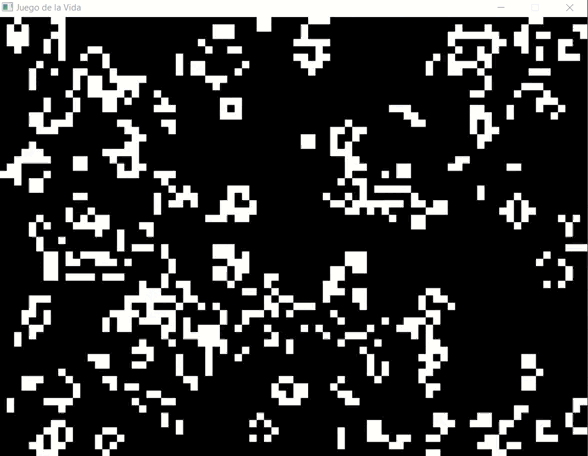

# Lab 2: Conway’s Game Of Life

En este laboratorio, se busca la aplicación práctica de los conceptos aprendidos en el rendereo en tiempo real. La tarea consiste en implementar el algoritmo de "The Game of Life" de Conway utilizando exclusivamente la función point previamente preparada. Este algoritmo, que opera en un conjunto de píxeles representando células, sigue reglas simples: cada célula (píxel) tiene ocho vecinos, puede estar viva o muerta (pintada de blanco o negro), y cada turno, equivalente a un fotograma, sigue reglas específicas. Estas reglas incluyen la muerte de una célula viva con menos de dos vecinos vivos (subpoblación), la supervivencia de una célula viva con dos o tres vecinos vivos, la muerte de una célula viva con más de tres vecinos vivos (sobrepoblación), y la resurrección de una célula muerta con exactamente tres vecinos vivos. Se sugiere trabajar inicialmente en una baja resolución, como 100x100, con la opción de realizar pruebas a resoluciones más altas al finalizar la implementación.

Este es mi resultado:

